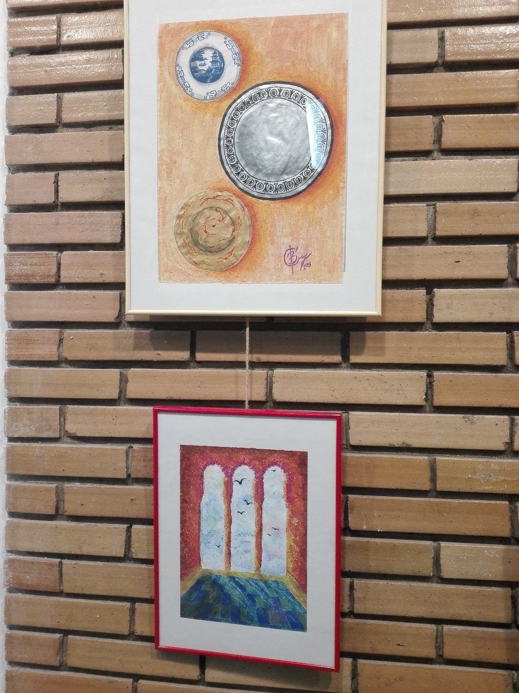

Bine ai venit în lumea artei. Pregătește-te să te bucuri de experiența ta aici, și de serviciile pe care noi ți le putem oferi. Am realizat acest magazin online pentru ca mulți să poată comanda artă, sub diferite forme. Fie că este vorba de realizarea unui portret, sau de lucururi personalizate, noi îți putem îndeplini dorința! Poți găsi în secțiunea products lucurile pe care le avem deja expuse, sau în secțiunea personalizări de unde poți comanda diferite obiecte care să aibă amprenta ta. Începe de acum călătoria artei!

<!-- carusel -->
<!-- css -->

<!-- html -->

    

        
1 / 3

        
        

    

    

        
2 / 3

        
        

    

    

        
3 / 3

        
        

    

 

    
    
    

<!-- js -->

<!-- /carusel -->
<!-- products -->
<!-- css -->

<!-- html -->
<!-- p1 -->
<h2>Personalizari</h2>

    

        

            

            <h3>Pictura jurnal</h3>
        

        

            <h3>Brelocuri</h3>
            

        

        

            <h3>Ghiozdane</h3>
            

        

        

            

            <h3>Caricaturi</h3>
        

        

            

            <h3>Tricouri</h3>
        

    

<!-- p2 -->
<h2>Produse</h2>

    

        

            

            <h3>Peisaj de toamna</h3>
        

        

            <h3>Noapte sinistra</h3>
            

        

    

<!-- /products -->
<!-- stiati ca -->
<h2>Știai că...?</h2>
<ol>
    <li>
        Leonardo da Vinci ar fi colaborat cu Verrocchio la realizarea “Botezului lui Cristos”, a pictat un înger care
        ridică roba lui Isus într-o manieră mult superioară de cea a maestrului său, încât Verrocchio, umilit, n-ar mai
        fi pictat niciodată.
    </li>
    <li>
        În 1472, după șase ani de studiu și muncă susținută, Leonardo da Vinci, la vârsta de numai 20 de ani, s-a
        calificat maestru.
    </li>
    <li>
        Ochiul uman poate distinge în jur de 10 milioane de culori diferite.
    </li>
    <li>
        Michelangelo a realizat Pietà(sculptură a Madonnei si fiului ei) la vârsta de 24 de ani.
    </li>
    <li>
        În anul 1549, Michelangelo a fost numit de Papă „arhitect-șef și constructor al bazilicii Sfântul Petru”
    </li>
</ol>
<!-- /stiati ca -->
<!-- De ce noi? -->
<!-- css -->

<!-- html -->
<h2>De ce noi?</h2>

    

        
    

    

        <h3>Alegere</h3>

        
Site-ul nostru oferă posibilitatea de achiziționare a artei deja expusă, și nu în ultimul rând îi dă
            posibilitatea cumpărătrului de a cumpăra tablouri/semne de carte/lucruri personalizate pe comandă. Aceasta
            însemnând că după preferințele cumpărătorului se va stabili tema tabloului(ex. Natură statică, portrete,
            artă abstractă) sau tema/citatul/desenul pentru personalizarea diferitelor obiecte(tricouri, semne de carte,
            etc.) și nu în ultimul rând stabilirea formelor pentru brelocuri.

        <h3>Satisfacție garantată</h3>

        
Posibilitatea de ați primi banii înapoi în termen de 7 zile, îți oferă curajul de a cumpăra cu încredere de
            pe site-ul nostru. Dacă dintr-un anumit motiv, nu ești satisfăcut de achiziția realizată, returneaz-o și te
            vom ajuta să găsești o lucrare care să îți placă.

        <h3>Artă originala și sustenabilă</h3>

        
Celiart.ro conține lucrări de artă realizate cu pasiune și din dorința de a crea frumosul. Lucrările expuse
            au fost făcute în timp și din materiale calitative ce vor rezista trecerii vremii. Astfel dorim să vă oferim
            cele mai frumoase products, executate cu măiestrie și rafinament destinate dumneavoastră, cumpărătorilor
            noștri.

        <h3>Transportul</h3>

        
Ne ocupăm de toate aspectele transportului pentru o livrare cât mai facilă și utilă pentru dumneavoastră. Nu
            va dura mai mult de 4 zile ca produsul dorit să ajungă la dumneavoastră.

        <h3>Realizare</h3>

        
Produsele noastre necesită timp, astfel că orice lucrare în funcție de gradul de dificultate va fi realizată
            în decursul a 3-5 zile. Perioadă în care artistul va creiona schița, va contopi culorile și va finaliza
            capodopera.

    

<!-- /De ce noi? -->